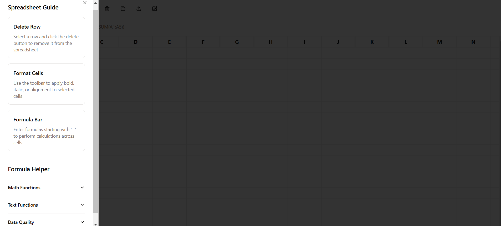

This Google Sheets clone boasts a range of features designed to provide a familiar and powerful spreadsheet experience.

1.  **Spreadsheet Interface:**
    *   Google Sheets-like UI with a user-friendly toolbar and formula bar.
    *   Intuitive cell selection and editing.
    *   Column and row resizing for customized layouts.
    *   Cell formatting options, including bold, italic, font size, and color.
    *   Ability to create Multiple file and save it so that it specify the the different file with differnt name and easy to find the file

## Web Preview
Here are some snapshots of the Web Application Mimicking Google Sheets :

<p align="center">
  
  
</p>

<p align="center">
   
  
</p>

2.  **Formula Support:**
    *   SUM: Calculates the sum of values within a specified range (e.g., =SUM(A1:A10)).
    *   AVERAGE: Determines the average of values within a range (e.g., =AVERAGE(B1:B5)).
    *   MAX: Identifies the maximum value within a range (e.g., =MAX(C1:C20)).
    *   MIN: Identifies the minimum value within a range (e.g., =MIN(D1:D20)).
    *   COUNT: Counts the number of numeric values within a range (e.g., =COUNT(E1:E10)).
    *   TRIM: Removes leading and trailing whitespace from text in a cell (e.g., =TRIM(A1)).
    *   UPPER: Converts text in a cell to uppercase (e.g., =UPPER(B1)).
    *   LOWER: Converts text in a cell to lowercase (e.g., =LOWER(C1)).
    *   REMOVE_DUPLICATES: Removes duplicate values from a range of cells (e.g., =REMOVE_DUPLICATES(A1:A10)).
    *   FIND_AND_REPLACE: Finds and replaces specific text within a cell (e.g., =FIND_AND_REPLACE(A1,"old","new")).
    *   CONCATENATE: Joins text from multiple cells into one cell (e.g., =CONCATENATE(A1:A3)).
    *   SUMIF: Sums values in a range based on a condition (e.g., =SUMIF(A1:A10,">50")).
    *   COUNTIF: Counts values in a range based on a condition (e.g., =COUNTIF(B1:B10,"<100")).

3.  **Toolbar Functionality:**
    *   **StyleEditor:** Allows users to modify the style of the text
    *   **Trash2:** Allows users to delete the row
    *   **Save:** Allows users to save the spreadsheet
    *   **Upload:** Allows users to upload the spreadsheet
    *   **Edit:** Allows users to edit the name of the spreadsheet

4.  **Data Entry and Validation:**
    *   Support for various data types, including numbers, text, and dates.
    *   Basic formula validation to catch syntax errors.

5.  **Data Visualization (Planned):**
    *   Future implementation of charting and graphing capabilities to visually represent spreadsheet data.

### Getting Started

1.  **Clone the repository:**

    ```bash
    git clone https://github.com/shuklaAlkesh/Clone-google-Sheet.git
    cd Clone-google-Sheet
    ```

2.  **Install dependencies:**

    ```bash
    npm install
    ```

### Running the Application

The application consists of both a backend server and a frontend client. To run both:

1.  **Development mode (runs both client and server):**

    ```bash
    npm run dev
    ```

    This will start:

    *   Frontend development server with hot reloading (typically on port 3000)
    *   Backend server (typically on port 5000)

### PostgreSQL Database Configuration

The application uses a PostgreSQL database to store spreadsheet data. You will need to configure the database connection details in the `.env` file.

```
DATABASE_URL=postgres://<user>:<password>@<host>:<port>/<database>
```

Replace the placeholders with your actual PostgreSQL database credentials.

## **Conclusion**  

This **Google Sheets Clone** replicates essential spreadsheet functionalities while offering a seamless and user-friendly experience. With features like **formula support, data validation, spreadsheet management, and planned data visualization**, it serves as a powerful tool for organizing and analyzing data efficiently.  

Whether you're managing financial records, tracking projects, or performing complex calculations, this application provides a **familiar and intuitive** environment for users. Future enhancements, such as **charting and advanced formula support**, will further improve its capabilities.  

If you find this project helpful, feel free to **contribute, suggest improvements, or report issues** in the GitHub repository. Your feedback and support will help shape the next version of this powerful spreadsheet tool. 🚀  

Happy Coding! 💡📊  
